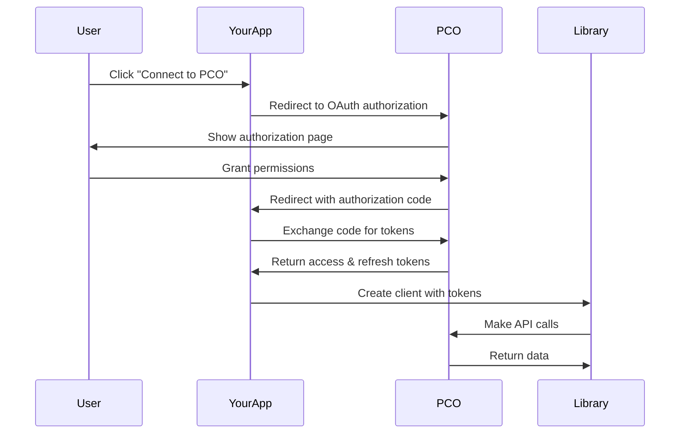

# Authentication Guide - v2.0.0

This guide covers all authentication methods supported by the Planning Center People TypeScript library v2.0.0, including setup, token management, and best practices.

## Authentication Methods Overview

The library supports two main authentication methods:

| Method | Use Case | Token Type | Refresh Support | Multi-User |
|--------|----------|------------|-----------------|------------|
| **Personal Access Token** | Server applications, single-user apps | Personal Access Token | ❌ | ❌ |
| **OAuth 2.0** | Multi-user applications, web apps | Access Token + Refresh Token | ✅ | ✅ |

## 1. Personal Access Token Authentication

### When to Use

- **Server-side applications** (Node.js, Express, Next.js API routes)
- **Single-user applications** (personal tools, scripts)
- **Background processes** (cron jobs, data sync)
- **Development and testing**

### Setup

#### Step 1: Create a Planning Center App

1. Go to [Planning Center Developer](https://api.planningcenteronline.com/)
2. Click "Create an App"
3. Fill in app details:
   - **Name**: Your application name
   - **Description**: Brief description of your app
   - **Website**: Your app's website (optional)
4. Select **People API** permissions
5. Click "Create App"

#### Step 2: Generate Personal Access Token

1. In your app settings, go to "Personal Access Tokens"
2. Click "Create Token"
3. Give it a descriptive name
4. Select the scopes you need (typically "People API - Read" and "People API - Write")
5. Copy the generated token (you won't see it again!)

#### Step 3: Configure Your Application

```typescript
import { PcoClient } from '@rachelallyson/planning-center-people-ts';

const client = new PcoClient({
  auth: {
    type: 'personal_access_token',
    personalAccessToken: 'your-personal-access-token-here'
  }
});
```

### Environment Variables

```env
# .env
PCO_PERSONAL_ACCESS_TOKEN=your_personal_access_token_here
```

```typescript
// Using environment variables
const client = new PcoClient({
  auth: {
    type: 'personal_access_token',
    personalAccessToken: process.env.PCO_PERSONAL_ACCESS_TOKEN!
  }
});
```

### Example: Server Application

```typescript
// src/pco-client.ts
import { PcoClient } from '@rachelallyson/planning-center-people-ts';

export const pcoClient = new PcoClient({
  auth: {
    type: 'personal_access_token',
    personalAccessToken: process.env.PCO_PERSONAL_ACCESS_TOKEN!
  },
  
  // Optional: Custom configuration
  timeout: 30000,
  rateLimit: {
    maxRequests: 90,
    perMilliseconds: 60000
  }
});
```

## 2. OAuth 2.0 Authentication

### When to Use

- **Multi-user applications** (web apps, mobile apps)
- **User-specific data access** (each user sees their own data)
- **Third-party integrations** (apps that other organizations install)
- **Public applications** (distributed to multiple churches)

### OAuth 2.0 Flow Overview



### Step 1: OAuth Configuration

#### Authorization URL

```
https://api.planningcenteronline.com/oauth/authorize?
  client_id=YOUR_APP_ID&
  redirect_uri=YOUR_REDIRECT_URI&
  response_type=code&
  scope=people
```

#### Token Exchange URL

```
POST https://api.planningcenteronline.com/oauth/token
Content-Type: application/x-www-form-urlencoded

client_id=YOUR_APP_ID&
client_secret=YOUR_APP_SECRET&
code=AUTHORIZATION_CODE&
redirect_uri=YOUR_REDIRECT_URI&
grant_type=authorization_code
```

### Step 2: Implementation Examples

#### Express.js OAuth Handler

```typescript
// src/auth/oauth.ts
import express from 'express';
import { PcoClient } from '@rachelallyson/planning-center-people-ts';

const router = express.Router();

// Step 1: Redirect to PCO authorization
router.get('/auth/pco', (req, res) => {
  const authUrl = new URL('https://api.planningcenteronline.com/oauth/authorize');
  authUrl.searchParams.set('client_id', process.env.PCO_APP_ID!);
  authUrl.searchParams.set('redirect_uri', process.env.PCO_REDIRECT_URI!);
  authUrl.searchParams.set('response_type', 'code');
  authUrl.searchParams.set('scope', 'people');
  
  res.redirect(authUrl.toString());
});

// Step 2: Handle OAuth callback
router.get('/auth/pco/callback', async (req, res) => {
  const { code, error } = req.query;
  
  if (error) {
    return res.status(400).json({ error: 'Authorization failed' });
  }
  
  try {
    // Exchange code for tokens
    const tokenResponse = await fetch('https://api.planningcenteronline.com/oauth/token', {
      method: 'POST',
      headers: {
        'Content-Type': 'application/x-www-form-urlencoded',
      },
      body: new URLSearchParams({
        client_id: process.env.PCO_APP_ID!,
        client_secret: process.env.PCO_APP_SECRET!,
        code: code as string,
        redirect_uri: process.env.PCO_REDIRECT_URI!,
        grant_type: 'authorization_code',
      }),
    });
    
    const tokens = await tokenResponse.json();
    
    // Save tokens to database
    await saveUserTokens(req.session.userId, tokens);
    
    // Create PCO client
    const client = new PcoClient({
      auth: {
        type: 'oauth',
        accessToken: tokens.access_token,
        refreshToken: tokens.refresh_token,
        onRefresh: async (newTokens) => {
          await saveUserTokens(req.session.userId, newTokens);
        },
        onRefreshFailure: async (error) => {
          console.error('Token refresh failed:', error.message);
          await clearUserTokens(req.session.userId);
        }
      }
    });
    
    res.json({ success: true, message: 'Connected to Planning Center!' });
  } catch (error) {
    console.error('OAuth error:', error);
    res.status(500).json({ error: 'Failed to connect to Planning Center' });
  }
});

export default router;
```

#### Next.js OAuth Implementation

```typescript
// pages/api/auth/pco.ts
import { NextApiRequest, NextApiResponse } from 'next';
import { PcoClient } from '@rachelallyson/planning-center-people-ts';

export default async function handler(req: NextApiRequest, res: NextApiResponse) {
  if (req.method === 'GET') {
    // Redirect to PCO authorization
    const authUrl = new URL('https://api.planningcenteronline.com/oauth/authorize');
    authUrl.searchParams.set('client_id', process.env.PCO_APP_ID!);
    authUrl.searchParams.set('redirect_uri', `${process.env.NEXTAUTH_URL}/api/auth/pco/callback`);
    authUrl.searchParams.set('response_type', 'code');
    authUrl.searchParams.set('scope', 'people');
    
    res.redirect(authUrl.toString());
  }
}

// pages/api/auth/pco/callback.ts
export default async function handler(req: NextApiRequest, res: NextApiResponse) {
  const { code } = req.query;
  
  try {
    const tokenResponse = await fetch('https://api.planningcenteronline.com/oauth/token', {
      method: 'POST',
      headers: { 'Content-Type': 'application/x-www-form-urlencoded' },
      body: new URLSearchParams({
        client_id: process.env.PCO_APP_ID!,
        client_secret: process.env.PCO_APP_SECRET!,
        code: code as string,
        redirect_uri: `${process.env.NEXTAUTH_URL}/api/auth/pco/callback`,
        grant_type: 'authorization_code',
      }),
    });
    
    const tokens = await tokenResponse.json();
    
    // Store tokens in session or database
    req.session.pcoTokens = tokens;
    await req.session.save();
    
    res.redirect('/dashboard');
  } catch (error) {
    res.status(500).json({ error: 'OAuth failed' });
  }
}
```

### Step 3: Token Management

#### Token Storage

```typescript
// src/services/token-manager.ts
interface StoredTokens {
  accessToken: string;
  refreshToken: string;
  expiresAt: Date;
  userId: string;
}

class TokenManager {
  async saveTokens(userId: string, tokens: any): Promise<void> {
    const expiresAt = new Date(Date.now() + tokens.expires_in * 1000);
    
    await database.tokens.upsert({
      userId,
      accessToken: tokens.access_token,
      refreshToken: tokens.refresh_token,
      expiresAt,
    });
  }
  
  async getTokens(userId: string): Promise<StoredTokens | null> {
    const stored = await database.tokens.findByUserId(userId);
    if (!stored || stored.expiresAt < new Date()) {
      return null;
    }
    
    return {
      accessToken: stored.accessToken,
      refreshToken: stored.refreshToken,
      expiresAt: stored.expiresAt,
      userId: stored.userId,
    };
  }
  
  async clearTokens(userId: string): Promise<void> {
    await database.tokens.deleteByUserId(userId);
  }
}

export const tokenManager = new TokenManager();
```

#### Client Factory

```typescript
// src/services/pco-client-factory.ts
import { PcoClient } from '@rachelallyson/planning-center-people-ts';
import { tokenManager } from './token-manager';

export async function createUserPcoClient(userId: string): Promise<PcoClient> {
  const tokens = await tokenManager.getTokens(userId);
  
  if (!tokens) {
    throw new Error('User not authenticated with Planning Center');
  }
  
  return new PcoClient({
    auth: {
      type: 'oauth',
      accessToken: tokens.accessToken,
      refreshToken: tokens.refreshToken,
      onRefresh: async (newTokens) => {
        await tokenManager.saveTokens(userId, newTokens);
      },
      onRefreshFailure: async (error) => {
        console.error('Token refresh failed for user:', userId, error.message);
        await tokenManager.clearTokens(userId);
        // Redirect user to re-authenticate
      }
    }
  });
}
```

## 3. Token Refresh Handling

### Automatic Token Refresh

The library automatically handles token refresh when using OAuth 2.0:

```typescript
const client = new PcoClient({
  auth: {
    type: 'oauth',
    accessToken: userAccessToken,
    refreshToken: userRefreshToken,
    
    // Called when tokens are successfully refreshed
    onRefresh: async (newTokens) => {
      console.log('Tokens refreshed successfully');
      await saveTokensToDatabase(userId, newTokens);
    },
    
    // Called when token refresh fails
    onRefreshFailure: async (error) => {
      console.error('Token refresh failed:', error.message);
      
      if (error.message.includes('invalid_grant')) {
        // Refresh token is invalid - user needs to re-authenticate
        await clearUserTokens(userId);
        redirectToLogin();
      } else if (error.message.includes('Network error')) {
        // Network issue - could retry later
        showNetworkErrorToast();
      }
    }
  }
});
```

### Manual Token Refresh

```typescript
// The library handles token refresh automatically
// But you can also implement manual refresh if needed

async function refreshUserTokens(client: PcoClient, refreshToken: string) {
  try {
    // The client will automatically refresh tokens when they expire
    // You don't need to manually call refresh endpoints
    const people = await client.people.getAll();
    return people;
  } catch (error) {
    console.error('Token refresh failed:', error);
    throw error;
  }
}
```

### Token Refresh Best Practices

```typescript
// src/middleware/token-refresh.ts
export async function withTokenRefresh<T>(
  userId: string,
  operation: (client: PcoClient) => Promise<T>
): Promise<T> {
  let client = await createUserPcoClient(userId);
  
  try {
    return await operation(client);
  } catch (error) {
    if (error instanceof PcoApiError && error.status === 401) {
      // Token might be expired, the client will automatically refresh
      // If refresh fails, the onRefreshFailure callback will be called
      throw new Error('Authentication expired. Please reconnect to Planning Center.');
    }
    throw error;
  }
}
```

## 4. Security Best Practices

### Environment Variables

```env
# Never commit these to version control
PCO_PERSONAL_ACCESS_TOKEN=your_token_here
PCO_ACCESS_TOKEN=your_oauth_access_token_here
PCO_REFRESH_TOKEN=your_oauth_refresh_token_here

# Use different values for different environments
PCO_PERSONAL_ACCESS_TOKEN_DEV=dev_token
PCO_PERSONAL_ACCESS_TOKEN_PROD=prod_token
```

### Token Storage Security

```typescript
// ✅ Good: Encrypt tokens in database
import crypto from 'crypto';

const ENCRYPTION_KEY = process.env.TOKEN_ENCRYPTION_KEY!;

function encryptToken(token: string): string {
  const cipher = crypto.createCipher('aes-256-cbc', ENCRYPTION_KEY);
  let encrypted = cipher.update(token, 'utf8', 'hex');
  encrypted += cipher.final('hex');
  return encrypted;
}

function decryptToken(encryptedToken: string): string {
  const decipher = crypto.createDecipher('aes-256-cbc', ENCRYPTION_KEY);
  let decrypted = decipher.update(encryptedToken, 'hex', 'utf8');
  decrypted += decipher.final('utf8');
  return decrypted;
}

// Store encrypted tokens
await database.tokens.save({
  userId,
  accessToken: encryptToken(tokens.access_token),
  refreshToken: encryptToken(tokens.refresh_token),
});
```

### HTTPS Only

```typescript
// ✅ Good: Force HTTPS in production
const client = new PcoClient({
  auth: {
    type: 'personal_access_token',
    personalAccessToken: process.env.PCO_PERSONAL_ACCESS_TOKEN!
  },
  baseURL: process.env.NODE_ENV === 'production' 
    ? 'https://api.planningcenteronline.com/people/v2'
    : 'http://localhost:3000/api/pco', // Development only
});
```

### Token Validation

```typescript
// Validate tokens before use
function validateTokens(tokens: any): boolean {
  if (!tokens.access_token || !tokens.refresh_token) {
    return false;
  }
  
  if (tokens.expires_in && tokens.expires_in < 60) {
    // Token expires in less than 1 minute
    return false;
  }
  
  return true;
}

// Use validation
const tokens = await tokenManager.getTokens(userId);
if (!validateTokens(tokens)) {
  throw new Error('Invalid or expired tokens');
}
```

## 5. Error Handling

### Authentication Errors

```typescript
import { PcoApiError } from '@rachelallyson/planning-center-people-ts';

try {
  const people = await client.people.getAll();
} catch (error) {
  if (error instanceof PcoApiError) {
    switch (error.status) {
      case 401:
        // Token expired or invalid
        console.log('Authentication failed - token may be expired');
        await handleTokenExpiration(userId);
        break;
        
      case 403:
        // Insufficient permissions
        console.log('Insufficient permissions for this operation');
        await handleInsufficientPermissions(userId);
        break;
        
      default:
        console.error('Other PCO error:', error.message);
    }
  }
}
```

### Token Refresh Error Handling

```typescript
const client = new PcoClient({
  auth: {
    type: 'oauth',
    accessToken: userToken,
    refreshToken: userRefreshToken,
    
    onRefreshFailure: async (error) => {
      console.error('Token refresh failed:', error.message);
      
      // Handle different failure scenarios
      if (error.message.includes('invalid_grant')) {
        // Refresh token is invalid - user needs to re-authenticate
        await clearUserTokens(userId);
        await notifyUserReauth(userId);
      } else if (error.message.includes('Network error')) {
        // Network issue - could be temporary
        await scheduleRetry(userId);
      } else {
        // Unknown error - log for investigation
        await logError(error);
      }
    }
  }
});
```

## 6. Testing Authentication

### Mock Authentication for Tests

```typescript
// tests/mocks/pco-client.ts
import { PcoClient } from '@rachelallyson/planning-center-people-ts';

export const mockPcoClient = new PcoClient({
  auth: {
    type: 'personal_access_token',
    personalAccessToken: 'mock-token'
  }
});

// Mock successful responses
jest.mock('@rachelallyson/planning-center-people-ts', () => ({
  ...jest.requireActual('@rachelallyson/planning-center-people-ts'),
  PcoClient: jest.fn().mockImplementation(() => ({
    people: {
      getAll: jest.fn().mockResolvedValue({
        data: [
          {
            id: '1',
            type: 'Person',
            attributes: {
              first_name: 'John',
              last_name: 'Doe',
            },
          },
        ],
      }),
    },
  })),
}));
```

### Integration Test Setup

```typescript
// tests/integration/auth.test.ts
import { PcoClient } from '@rachelallyson/planning-center-people-ts';

describe('Authentication Integration', () => {
  let client: PcoClient;
  
  beforeAll(() => {
    client = new PcoClient({
      auth: {
        type: 'personal_access_token',
        personalAccessToken: process.env.PCO_PERSONAL_ACCESS_TOKEN!
      }
    });
  });
  
  it('should authenticate successfully', async () => {
    const people = await client.people.getAll({ perPage: 1 });
    expect(people.data).toBeDefined();
  });
  
  it('should handle invalid credentials', async () => {
    const invalidClient = new PcoClient({
      auth: {
        type: 'personal_access_token',
        personalAccessToken: 'invalid-token'
      }
    });
    
    await expect(invalidClient.people.getAll()).rejects.toThrow();
  });
});
```

## 7. Troubleshooting

### Common Authentication Issues

#### Issue: "Invalid credentials"

```typescript
// Check your credentials
console.log('Personal Access Token:', process.env.PCO_PERSONAL_ACCESS_TOKEN ? 'Set' : 'Not set');
console.log('OAuth Access Token:', process.env.PCO_ACCESS_TOKEN ? 'Set' : 'Not set');
console.log('OAuth Refresh Token:', process.env.PCO_REFRESH_TOKEN ? 'Set' : 'Not set');
```

#### Issue: "Token expired"

```typescript
// For OAuth tokens, implement refresh logic
const client = new PcoClient({
  auth: {
    type: 'oauth',
    accessToken: userToken,
    refreshToken: userRefreshToken,
    onRefresh: async (newTokens) => {
      await saveTokensToDatabase(userId, newTokens);
    }
  }
});
```

#### Issue: "Insufficient permissions"

```typescript
// Check your app's permissions in PCO Developer Console
// Ensure you have the required scopes for your operations
```

### Debug Mode

```typescript
// Enable debug logging with the event system
const client = new PcoClient({
  auth: {
    type: 'personal_access_token',
    personalAccessToken: process.env.PCO_PERSONAL_ACCESS_TOKEN!
  }
});

// Listen to authentication events
client.on('auth:failure', (event) => {
  console.error('Authentication failed:', event.error.message);
});

client.on('error', (event) => {
  console.error('API Error:', event.error.message);
});
```

## Next Steps

- 📚 **[API Reference](./API_REFERENCE.md)** - Explore all available methods
- 💡 **[API Usage Guide](./API_USAGE_GUIDE.md)** - See real-world usage patterns
- 🛠️ **[Best Practices](./BEST_PRACTICES.md)** - Production best practices
- 📚 **[Examples](./EXAMPLES.md)** - Complete examples

---

*Having trouble with authentication? Check our [Troubleshooting Guide](./TROUBLESHOOTING.md) or [open an issue](https://github.com/rachelallyson/planning-center-people-ts/issues) for help.*
